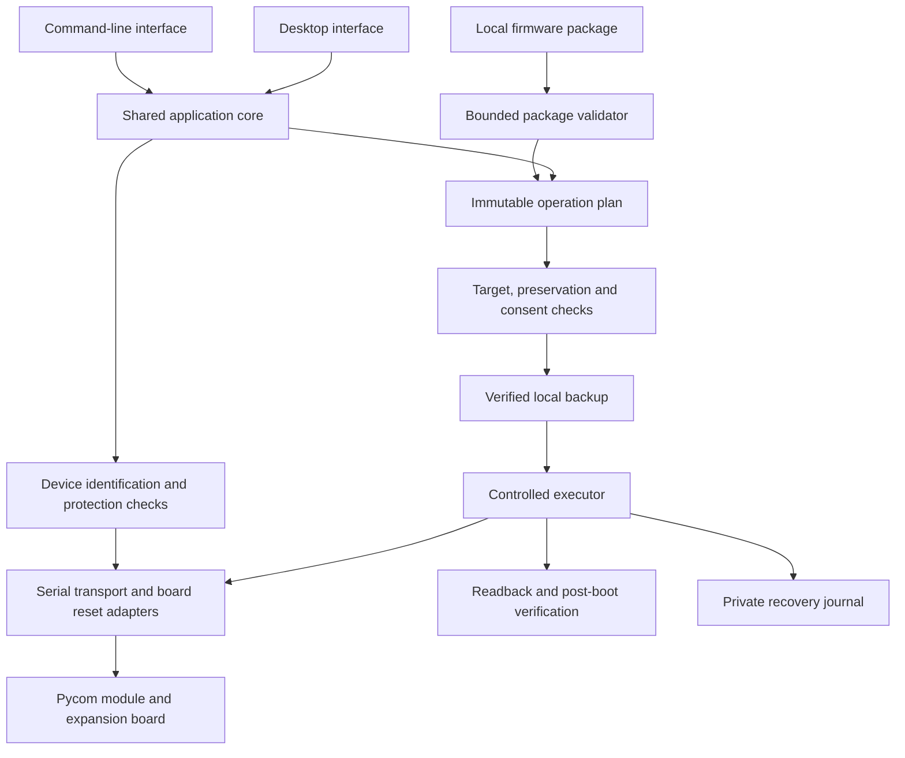

# Proposed architecture

**Status:** design proposal. No components below are implemented in this fork.

## Shared core, two interfaces

The desktop application is a frontend to the same core used by the CLI. It cannot
skip target validation, backup policy, preservation rules, or protection checks.
Firmware package parsing is pure and testable without serial hardware.

## Component boundaries

| Component | Responsibility | Must not do |
| --- | --- | --- |
| Package reader | Validate bounded archive metadata and payloads | Reset a device or execute arbitrary package code |
| Device model | Family, revision, layout, flash size, reset strategy | Guess identity from a friendly USB name |
| Planner | Exact writes/erases, preserved ranges, compatibility | Mutate hardware or silently accept unknown metadata |
| Transport | Bounded serial I/O, reset adapters, exclusive access | Decide erase policy or log secrets |
| Backup store | Atomic local writes, manifest, checksums, permissions | Upload raw backups or allow incompatible restores |
| Executor | Follow an approved plan and record safe checkpoints | Burn eFuses or invent a rollback guarantee |
| Verifier | Readback, boot checks, preservation evidence | Equate process exit zero with a successful device update |
| UI/CLI | Intent, consent, progress, errors, diagnostic export | Maintain separate flash algorithms |

## Proposed operation lifecycle

`inspect package → select device → probe with consent → validate target → plan →
verify backup → confirm destructive intent → execute → readback → boot check → result`

Cancellation before writing returns to a safe idle state. After an erase/write
begins, cancellation may leave an incomplete image; the result must identify
completed ranges and provide an explicit recovery path. A private journal is
evidence for diagnosis, not permission to resume without reidentifying the device.

One process owns a serial device for an operation. Lock handling, cleanup, timeouts,
and disconnects are explicit. Device enumeration remains passive; probing and
resetting are separate, visible operations.

## Trust boundaries and data

Firmware packages are untrusted input even when their extension is `.tar.gz`.
Validate paths, types, limits, allowed operations, target layout, and payload ranges.
Never execute shell commands or Python shipped inside a package.

Backups may contain Wi-Fi passwords, cloud tokens, device identifiers, and radio
credentials. Store them locally with private permissions and bounded retention
under operator control. Publish only redacted diagnostics. Hashes detect content
changes; they do not prove publisher authenticity.

Initially, a protected/encrypted device is unsupported unless the exact workflow
has been qualified. Do not change secure-boot provisioning or irreversible eFuses.

## Technology decisions still open

| Decision | Candidates or starting point | Required evidence |
| --- | --- | --- |
| Core language | Python; evaluate 3.12 baseline | Dependency compatibility and version lifecycle |
| Serial engine | Qualified Pycom adapter; evaluate newer esptool later | Protocol/package equivalence tests |
| Desktop UI | PySide6/Qt, Tkinter, SwiftUI frontend | Accessibility, licenses, native packaging, maintenance |
| macOS packaging | PyInstaller universal2 candidate | Complete binary audit and native ARM/Intel qualification |
| Minimum macOS | Unselected | Clean-host and physical-device results |
| Application license | Unselected until engine reuse is resolved | Per-file terms and distribution obligations |

Record consequential decisions in `docs/decisions/` when made. An ADR includes
context, alternatives, evidence, decision, consequences, and a revisit trigger.
See [the milestone plan](MAINTENANCE_PLAN.md) for ordering and acceptance criteria.
