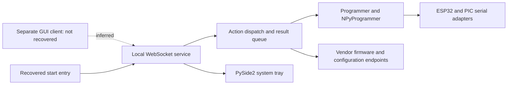

# Installer findings and GUI reconstruction

**Status:** observed static evidence plus a proposed implementation route.
**Evidence:** [installer snapshot and reproduction](../research/installer-v1.0.3/README.md).
Also see [classic GUI recovery](../research/classic-gui-1.16.6/README.md).
The repository still has no runnable community GUI or flashing engine.

## Why native Apple Silicon is the main goal

The purpose is to keep a usable graphical updater for existing Pycom modules when
macOS stops supporting the Intel translation path. This is continuity of hardware
support, not just a performance improvement or a CLI port.

[Apple's Rosetta support notice](https://developer.apple.com/news/?id=w5ngl9k2)
identifies macOS 27 as the final release with general Intel-app translation.
[Apple Support](https://support.apple.com/en-us/102527) states that, beginning with
macOS 28, Rosetta functionality is limited to certain older games. This general
application does not qualify for that described games exception. These are Apple's
published boundaries checked on 2026-10-06; future platform guidance must be rechecked.

Native ARM is the first qualification target. Universal2 can retain Intel support
during the transition when dependencies and actual native-host results permit it.
An Intel-only app running under Rosetta is not the project's acceptance target.

## What the installer actually contains

Two distinct historical artifacts were inspected:

| Artifact | Observed purpose | Recovery |
| --- | --- | --- |
| GitHub `v1.0.3` macOS package | Pybytes local WebSocket service and Qt tray | 24 candidate-module disassemblies and 23 partial previews |
| Separately distributed desktop `1.16.6` DMG | Standalone Python 2.7/PyQt4 update wizard | 11 GUI/core previews and 11 disassemblies; syntax checked, behavior unverified |

The **classic desktop wizard** is the historical GUI reference for the native
Apple Silicon product. It is not the same application as the service package.
The following service findings are limited to that package; they do not imply
that Pycom lacked a separately distributed desktop GUI.

The welcome resource describes a firmware update **service for Pybytes**, version
`1.0.0`. Its executable is a Python 3.9 PyInstaller application for x86_64. PySide2
implements a tray icon/menu, while `server` implements a local WebSocket service.

No full-screen update wizard, browser HTML/JavaScript bundle, or standalone desktop
window implementation was found in this inspected macOS asset. This is an observed
scope limit, not proof that another release or remote frontend never existed.
The recovered service and Pybytes wording suggest a separate graphical web client;
that client is **not recovered here**. Patching/repacking this service alone would
not deliver the complete GUI the project aims to maintain.

The external-client edge is an inference. The service, action, programmer, tray,
and vendor-reference edges are supported by decoded instructions/imports.

## Component map

| Recovered candidate | Observed responsibility | Reconstruction implication |
| --- | --- | --- |
| `start` | Host mapping helper, queue worker thread, server listen | A modern GUI needs an explicit, controlled application lifecycle |
| `server.Server` | WebSocket clients, message dispatch, queue, certificates, tray state | Prefer direct core calls for a local desktop UI; review IPC if retained |
| `tray.SystemTrayIcon` | Status tooltip and exit menu | Tray is optional; it is not the update wizard |
| `utils.actions` | Discovery, information, configuration, downloads, erase/write dispatch | These actions help enumerate GUI capabilities and core boundaries |
| `classes.result.Results` | Result/error envelopes with correlation metadata | Replace implicit messages with typed progress/results and operation IDs |
| `programmer.Programmer` | Device connection, metadata/configuration, flash worker | Keep hardware work off the UI thread and validate operation ownership |
| `npy_programmer.NPyProgrammer` | Lower-level flash/configuration/PIC operations | Compare behavior with public engine source before selecting a transport |
| `updater` | CLI parsing and firmware tar loading | Use package semantics as research input; do not equate previews with a qualified parser |
| `utils.constants`, `utils.partitions` | Board identifiers, baud rates, historical partition candidates | Layouts require device/package evidence; do not hard-code them as universal |
| `utils.addHost`, `utils.hosts` | Vendor hostname mapping in hosts files | A maintained desktop GUI should avoid system hosts-file changes |
| `settings` | Optional local settings, SSL/host defaults, credential-bearing fallbacks | Embedded credentials are removed from research; do not carry this design forward |

These are candidate roles, not license-cleared imports or tested features.

## Recovered action surface

The decoded dispatch/action code contains the following operation names:

| Action/result name | GUI behavior to evaluate | Qualification boundary |
| --- | --- | --- |
| `scan_ports` | Choose a connected port | Enumeration must remain separate from reset/probing |
| `infos` | Show chip, flash identifier, and device identity | Requires consent before active communication |
| `device_config` | Display readable device configuration | Secrets stay local and masked in exports |
| `remote_config` | Vendor configuration path | Optional future integration, outside initial offline GUI |
| `download_firmware_locally` | Download a selected package | Initial GUI accepts local packages; remote sources require separate trust review |
| `region_list`, `sigfox_region_list` | Radio-region choices | Historical endpoint values need validation and offline alternatives |
| `erase_flash` | Explicit destructive operation | Never expose as an ordinary default update |
| `write_firmware` | Run an approved update plan | Backup, compatibility, preservation, verification, and recovery gates apply |

The result envelope contains `action`, `results`, and `timeoutRef`; the service
has a historical `localhost:8765` default. These facts aid compatibility research,
but do not constitute a complete, verified protocol specification. No vendor
endpoint or recovered credential was used, and no local listener was started.

## What the decompiler could and could not recover

Automatic previews recover useful imports, class/function names, constants, and
some bodies. However, Python 3.9 exception matching, keyword argument handling,
and dictionary operations expose gaps in this decompiler. The full per-module
results and symbol index are in the [manifest](../research/installer-v1.0.3/manifest.json).

The entry point demonstrates why syntax checks alone fail: automatic output parses
but mistranslates `threading.Thread(target=...)`. The disassembly records the actual
`CALL_FUNCTION_KW` and `('target',)` tuple. Large operations may collapse to `pass`
with incomplete warnings. No preview is admitted as runtime code or claimed to be
equivalent to the original application.

Further recovery should compare multiple decoders where practical, reconstruct
individual functions from instructions, and verify their control flow and call
arguments against disassembly. Package/transport behavior also needs synthetic
fixtures and physical-device tests; valid Python is insufficient.

## GUI-first implementation route

### Classic wizard baseline

The separate public `1.16.6` download contains `CustomWizard` and `CustomWizardPage`
in [pycom_fwtool](../research/classic-gui-1.16.6/recovered/pycom_fwtool.py.txt).
Its recovered pages cover welcome, device type, radio region, setup, serial port,
device information, optional Pybytes registration, license selection, advanced
settings, local firmware/download, upgrading, and result. Worker modules separate
device queries, fetching, and upgrading from the wizard callbacks.

Preserve useful local-file and device-selection behavior while rebuilding the UI
over a qualified core. Inventory each page, branch, callback, and persistence field
before porting. The obsolete Python 2.7/PyQt4 stack requires modernization; merely
changing executable architecture does not make it a maintained ARM GUI.

All eleven normalized classic previews pass an offline Python 2 grammar check,
but semantic equivalence and runtime behavior have not been tested. A completed
decompiler pass is stronger extraction evidence than the service previews, not a
qualified implementation. Both artifact sets retain unresolved reuse rights.

### Intended application

The intended deliverable is a **standalone, native Apple Silicon desktop GUI**.
The CLI and analysis tools support implementation and verification; a CLI-only
release does not fulfill that deliverable.

1. Resolve component reuse/licensing and decide the GUI toolkit. Evaluate modern
   PySide6/Qt and SwiftUI against packaging, accessibility, and maintenance needs.
   Include a port/rewrite comparison for the recovered PyQt4 wizard. Do not preserve
   obsolete PyQt4/PySide2 dependencies merely because they were recovered.
2. Build the GUI shell with a simulated backend in parallel with core qualification:
   welcome, device selection, package selection, inspection, backup/preservation,
   confirmation, progress, verification, recovery, and redacted report export.
3. Define one core API used by the desktop UI and optional CLI. Use explicit
   operation states and typed results, and keep serial ownership in a worker.
4. Implement an offline-first path with local firmware packages and documented
   package validation. Remote vendor integration must not be required to open the
   application or complete the supported local update workflow.
5. Qualify read-only diagnostics/backups before enabling destructive GUI controls.
   Erase/write controls remain disabled until their applicable gates are satisfied.
6. Validate the complete GUI on a native ARM clean host without Rosetta, Python,
   or Homebrew, including accessibility, cancellation, disconnects, and recovery.
7. Sign/notarize the qualified application. Build universal2 only after all native
   dependencies have ARM and Intel support and both host/device paths are verified.

The recovered code informs research. It is not an instruction to retain vendor
certificates, credentials, system-wide installation, hosts-file edits, or cron jobs.
See [architecture](ARCHITECTURE.md), [maintenance milestones](MAINTENANCE_PLAN.md),
and the [reference publication decision](decisions/0001-installer-reference-recovery.md).
